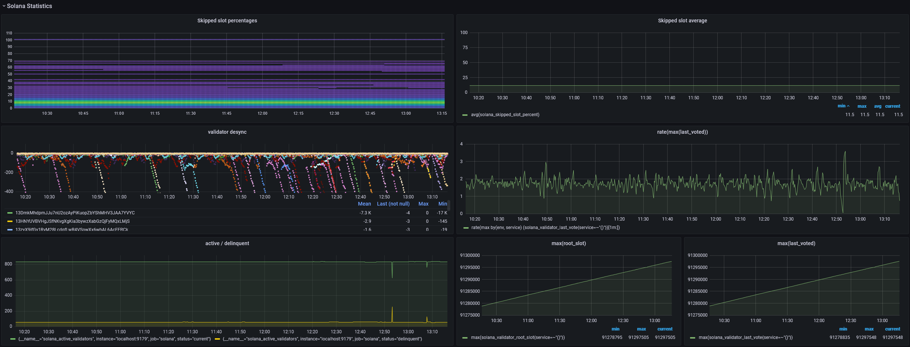

# Grafana

After `solana-exporter` exports gauges and metrics to Prometheus, it may be useful to visualise these metrics.
[Grafana](https://grafana.com/) allows you to create custom dashboards using Prometheus as a data source.

The repository includes a basic dashboard (`rustiq2.json`) that shows off a range of gauges that `solana-exporter`
can export using graphs. Some included visualisations include the monitoring of basic cluster statistics such as
transactions per second, skipped slots percentage. Decentralisation metrics such as the distribution of staked SOL
across datacenters can also be tracked (MaxMind account required).

For an in-depth explanation of each exported gauge, see then next chapter.