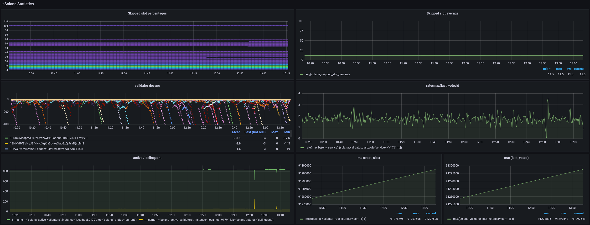

# Prometheus & Grafana

## Setting up Prometheus

If querying a public RPC port, `solana-exporter` can be run from anywhere, not necessarily from the
validator machine. If querying a private RPC port, install Prometheus on the validator machine. Add
the following snippet to the `scrape_configs` section of the `prometheus.yml` config file:

```
  - job_name: solana
    static_configs:
      - targets: ['localhost:9179']
```

Restart Prometheus. Now the `solana-exporter` metrics should be available to view at
`http://localhost:9179/metrics`. If running on the validator machine, it is highly advisable to only
open the Prometheus datasource port to the Grafana machine. This can be achieved with `nft`. Here is
an example `/etc/nftables.conf`:

```
#!/usr/sbin/nft -f

flush ruleset

table inet filter {
    chain input {
        type filter hook input priority 0;
        # allow connection to Prometheus datasource only locally and from Grafana
        ip saddr { 127.0.0.1, <Grafana IP> } tcp dport 9090 accept
        tcp dport 9090 drop
        # allow connection to Prometheus exporter endpoints only internally
        ip saddr != 127.0.0.1 tcp dport 9100 drop
        ip saddr != 127.0.0.1 tcp dport 9179 drop
    }
    chain forward {
        type filter hook forward priority 0;
    }
    chain output {
        type filter hook output priority 0;
    }
}
```

Note the order of commands. An `accept` clause should appear before the corresponding `drop` clause.

When `solana-exporter` is used on a mainnet validator node, Grafana must always run on a different
machine to circumvent potential DDoS attacks on the validator. In the Grafana dashboard, add the
Prometheus data source `http://<Validator IP>:9090`. Then import the `rustiq2.json` using that data source.

## Setting up Grafana

After `solana-exporter` exports gauges and metrics to Prometheus, it may be useful to visualise these metrics.
[Grafana](https://grafana.com/) allows you to create custom dashboards using Prometheus as a data source.

The repository includes a basic dashboard (`rustiq2.json`) that shows off a range of gauges that `solana-exporter`
can export using graphs. Some included visualisations include the monitoring of basic cluster statistics such as
transactions per second, skipped slots percentage. Decentralisation metrics such as the distribution of staked SOL
across datacenters can also be tracked (MaxMind account required).



For an in-depth explanation of each exported gauge, see then next chapter.