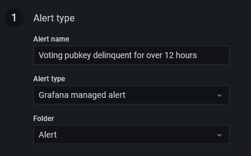
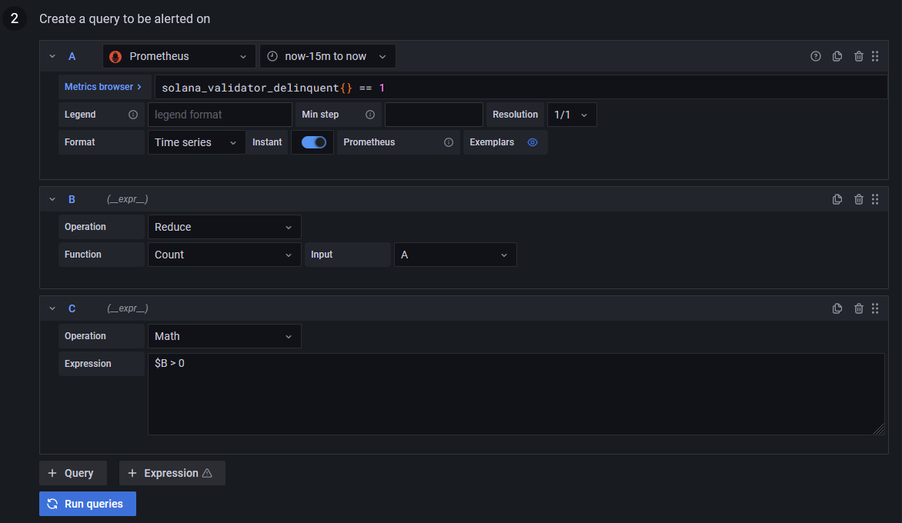

# Using Grafana alerts

After setting up `solana-exporter` to monitor a stakepool, it may be useful to set up Grafana alerts to notify relevant
operators of critical changes, and even automatically act to fix potential issues.

This example uses the new [Grafana 8 Alerts](https://grafana.com/docs/grafana/latest/alerting/unified-alerting/).

## Creating an alert

For extra documentation on how to create and manage Grafana alerts, refer to
the [official documentation](https://grafana.com/docs/grafana/latest/alerting/unified-alerting/alerting-rules/).

### Node delinquency

In this example, we will make an alert that fires if a voting pubkey becomes delinquent for over 12 consecutive hours.

1. [Create a Grafana managed alerting rule.](https://grafana.com/docs/grafana/latest/alerting/unified-alerting/alerting-rules/create-grafana-managed-rule/)
   Give it an appropriate name and place it in a folder.

   
2. Set up the query to be alerted on. You need three queries:
    * Prometheus **(A)** - `solana_validator_delinquent{} == 1`. This filters for all delinquent (1) nodes. Select an
      appropriate time-range. For example, a "now-15m to now" time range means that, when evaluating, the alert system
      treats any duration of delinquency during the last 15 minutes as delinquency.
    * Expression **(B)** - Reduce **(A)** by using the Count function. This counts how many delinquent nodes there are.
    * Expression **(C)** - Use the Math expression `$B > 0`. This expression will be used to fire an alert.

   

3. Define the alert condition to use **(C)** and evaluate every `1m` for `12h`. This instructs Grafana to check for
   delinquency every minute, and firing an alert if a node is delinquent for more than 12 hours. Set the "Alert state if
   no data or all values are null" to be "OK", as the Prometheus query returns nothing if all nodes are active. Finally,
   choose if you wish timeouts or query errors to fire an alert.

To test this alert, invert the query **(A)** with `solana_validator_delinquent{} == 0` and temporarily reduce the firing
threshold from `12h` to a more responsive value. Within a few minutes, an alert should be fired.

## Setting up an alert receiver on Discord

[Discord](https://discord.com/) is a VoIP, instant messaging and digital distribution platform designed for creating
communities. Grafana can send automated notifications to Discord to alert node operators of potential issues.

1. [Add Discord as a notification channel in Grafana.](https://grafana.com/docs/grafana/latest/alerting/unified-alerting/contact-points/#discord)
2. Be sure to enable Discord notifications for the relevant alerts.
